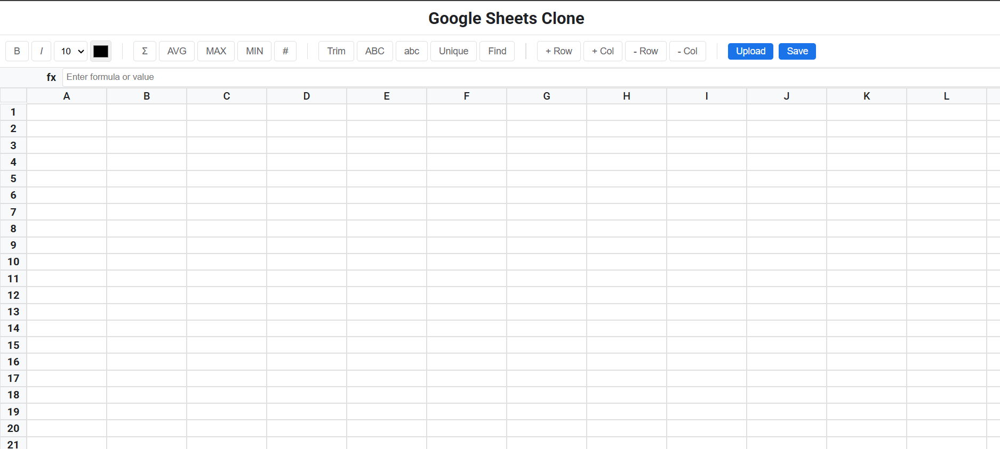

# Google Sheets Clone



This project is a web application that mimics the core functionalities and user interface of Google Sheets. It allows users to create and manipulate spreadsheet data, apply mathematical and data quality functions, and interact with the sheet in a familiar way.

## Features

*   **Spreadsheet Interface:**
    *   Visually similar layout to Google Sheets, including toolbar, formula bar, and cell grid.
    *   Cell selection and content editing.
    *   Basic cell formatting (bold, italics, font size, color).
    *   Column resizing.
    *   Row and column addition/deletion.
*   **Mathematical Functions:**
    *   `SUM`: Calculates the sum of a range of cells.
    *   `AVERAGE`: Calculates the average of a range of cells.
    *   `MAX`: Returns the maximum value from a range of cells.
    *   `MIN`: Returns the minimum value from a range of cells.
    *   `COUNT`: Counts the number of cells containing numerical values in a range.
*   **Data Quality Functions:**
    *   `TRIM`: Removes leading and trailing whitespace from a cell.
    *   `UPPER`: Converts the text in a cell to uppercase.
    *   `LOWER`: Converts the text in a cell to lowercase.
    *   `REMOVE_DUPLICATES`: Removes duplicate rows from a selected range.
    *   `FIND_AND_REPLACE`: Finds and replaces specific text within a range of cells.
*   **Data Entry and Validation:**
    *   Input for numbers, text, and dates.
    *   Basic data validation for numeric cells.
*   **File Upload and Save:**
    *   Upload `.xlsx` files
    *   Save the spreadsheet as an `.xlsx` file

## Tech Stack

*   **React:**  For building the user interface and handling component logic.
*   **Next.js:**  A React framework for server-side rendering, routing, and API endpoints.
*   **XLSX (js-xlsx):**  A library for parsing and writing Excel files.
*   **CSS Modules:**  For styling components with scoped CSS.

## Data Structures

*   **`state.data`:** (Object)
    *   A key-value store where the key is the cell ID (e.g., "A1") and the value is an object containing cell properties:
        *   `value`: The displayed value of the cell (string, number, date, etc.).
        *   `formula`: The formula entered by the user (if any).
        *   `style`: An object containing style properties (bold, italic, fontSize, color, backgroundColor).
*   **`state.selectedCell`:** (String)
    *   The ID of the currently selected cell.
*   **`state.selectedRange`:** (Array)
    *   An array of cell IDs representing the selected range (for operations like SUM, AVERAGE, etc.).
*   **`state.columnWidths`:** (Object)
    *   A key-value store where the key is the column letter (e.g., "A") and the value is the width of the column in pixels.
*    **`state.rowHeights`:** (Object)
    *   A key-value store where the key is the row number (e.g., "1") and the value is the height of the row in pixels.

## Why These Technologies?

*   **React:** Component-based architecture makes it easy to manage UI elements and cell updates.
*   **Next.js:** Provides server-side rendering for improved performance and SEO, as well as easy API route creation.
*   **XLSX:** Simplifies the process of reading and writing Excel files, allowing users to import and export their spreadsheet data.
*   **CSS Modules:** Encapsulates styles within components, preventing naming conflicts and improving maintainability.

## Getting Started

1.  Clone the repository:

    ```bash
    git clone <repository-url>
    ```

2.  Navigate to the project directory:

    ```bash
    cd google-sheets-clone
    ```

3.  Install dependencies:

    ```bash
    npm install
    # or
    yarn install
    # or
    pnpm install
    ```

4.  Run the development server:

    ```bash
    npm run dev
    # or
    yarn dev
    # or
    pnpm dev
    ```

5.  Open your browser and navigate to [`http://localhost:3000`](google-sheets-clone/.next/static/chunks/polyfills.js ).

